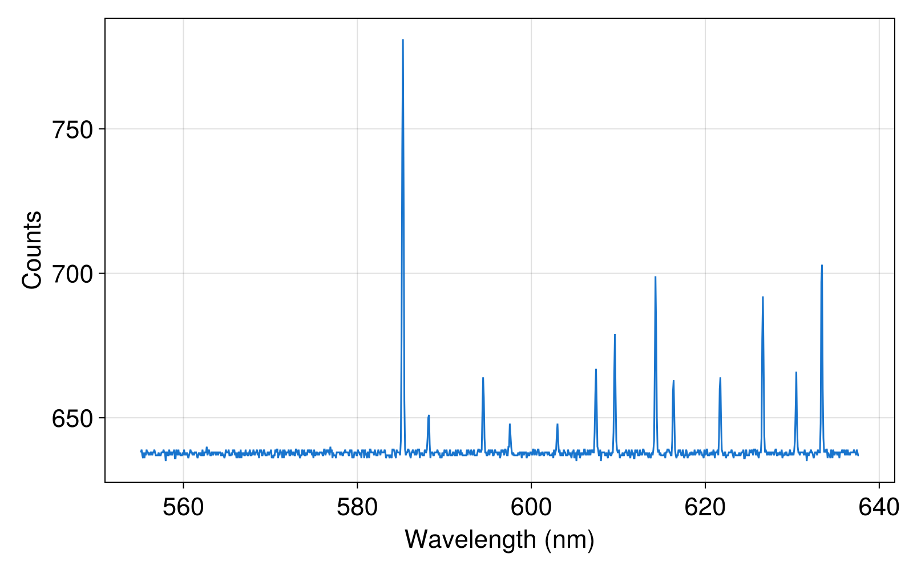

# SIFKit.jl 📦: A andor sif analysis tools in Julia


📦 **SIFKit.jl** is a Julia package for parsing Andor `.sif` camera files and providing tools for spectra analysis and data inspection.

## 📦 Features

- Efficient `.sif` binary parsing
- Easy access to image stacks, dimensions, metadata
- Spectrum data extraction and analysis tools
- Designed to support large datasets with minimal memory allocation

## 🧪 Installation

In julia REPL, type

```julia REPL
] add SIFKit
```
## 🚀 Usage

```julia
using SIFKit

sif_data = load(test_path)
@show size(sif_data.data)      # (width, height, frames)
@show sif_data.metadata["ExposureTime"]  # exposure time

waveLengths = sifer_utils.retrieveCalibration(sifImage.metadata)

isRaman = sif_data.metadata["FrameAxis"] == "Raman Shift"

if isRaman
    RamanExcitation = sifImage.metadata["RamanExWavelength"]
    RamanShift = sifer_utils.Wavelength2Raman.(RamanExcitation, waveLengths)
end

using CairoMakie

f = Figure(size = (800,500), fontsize = 22)

ax = Axis(f[1,1], 
            xlabel = sifImage.metadata["FrameAxis"]*" (nm)",
            ylabel = "Counts",
            xticks = 500:20:700)

data = dropdims(sifImage.data, dims = (2,3)) # assume single frame

lines!(ax, isRaman ? RamanShift : waveLengths, data, color=:dodgerblue3, label="Frame 1")

save("_makie.png", f, px_per_inch = 10)

display(f) # wait(display(f)) if you use GLMakie and a pop-out window

# what a nice spectrum!
```


If you or your collaborators like txt files better, then do

```julia

Export2Txt(sif_data, "_data.txt")

# then output a _data.txt containing metadata and data

```

## 🔧 Developer Notes


Clean and re-precompile

```bash
rm -rf ~/.julia/compiled/v1.10/SIFKit

julia --project=.

] add APackage (dependency in the package => update project.toml by adding APackage)

] precompile 

] test (run test/runtests.jl)
```

## 🤝 Contributing
Contributions and issues are welcome! Please open a PR or submit an issue if you run into any bugs or have feature requests.

## 📜 License
MIT License. 
